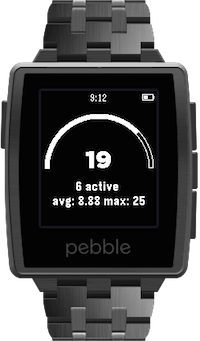
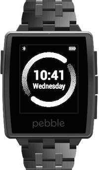
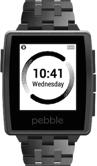
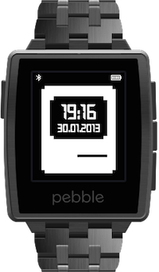
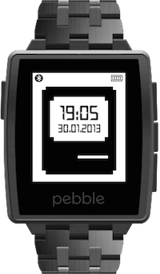
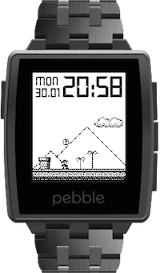
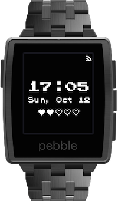

## GoSquared for Pebble

    

[GoSquared for Pebble project page](https://github.com/rmlewisuk/gosquared-for-pebble)

## Relay FM

Created for [Myke Hurley](http://relay.fm).

- [Black](faces/RelayFMDigital.pbw)
- [White](faces/RelayFMDigitalWhite.pbw)

## 512 Watch Faces

Created for [Stephen Hackett](http://512pixels.net).

- [Black](faces/512pixelsblack.pbw)
- [White](faces/512pixels.pbw)

## Super Mario v2

I wanted a Pebble SDKv2 version of [this](http://www.mypebblefaces.com/apps/12151/7828/), so I made one.

- [Download](faces/SuperMario.pbw)

## Retro Time 24hr

Modified version of [Retro-Time](https://github.com/jonwgeorge/Retro-Time); different font, battery meter centered and changed to 20% sections.

- [Download](faces/RetroTime24hr.pbw)
